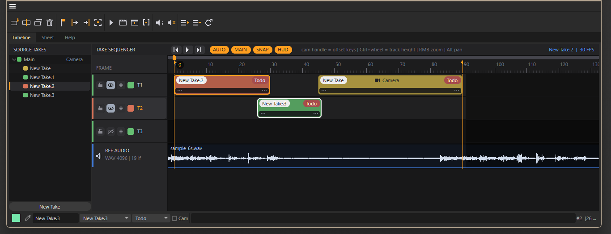

# TakeGear

**Timeline-driven Take switcher for Cinema 4D 2024 / 2025 / 2026** — an editorial-style multitrack sequencer that decides which Take is active at which point in time, while staying 100% inside Cinema 4D's native Take and render workflow.

[Русская версия →](README.ru.md)



🎬 **[Watch the demo video](docs/TakeGearDemo.mp4)**

Think of it as a visual director for Cinema 4D Takes: lay out your Takes as clips on a timeline, scrub through your scene states like an edit, and render the whole sequence through Cinema 4D's own render pipeline.

> TakeGear is **not** a video editor (it does not cut rendered footage) and **not** a full retiming system — scene animation stays on Cinema 4D's global timeline. Camera timing *can* be linked to a clip when needed.

---

## Features

### Timeline editing
- Multitrack Take timeline: drag, trim, split, duplicate, and arrange Take clips
- Multi-selection: Shift+click, rubber-band marquee, group move/delete/duplicate
- Clipboard: copy/paste clips at the playhead (`Ctrl+C` / `Ctrl+V`), select all (`Ctrl+A`)
- Ripple delete — remove clips and close the gap across all tracks (`Shift+Del`)
- Per-track lock / visibility / solo, track colors, user-resizable track height
- Snapping to clip edges, markers, IN/OUT and the playhead
- Editable markers and IN/OUT range handles (IN/OUT drive the document preview range live)
- Frame thumbnails inside clips, rendered in the background (no UI stalls)
- Drag & drop Takes from the Source Takes panel straight onto a track

### Take integration
- Automatic Take switching during playback, scrubbing, preview and rendering
- Outside any clip the Main Take is restored (optional)
- Source Takes hierarchy panel: click to activate, full right-click management (camera, render settings, mark for render, duplicate, child takes)
- A detailed **Settings** window per clip/take (frames, track, color, status, notes, camera, render settings)
- Renaming a Take through TakeGear automatically rebinds its clips

### Camera tools
- Camera name and its keyframes are shown on every clip
- **Camera key-offset handle**: drag the strip at the bottom of a clip to slide the Take camera's keys in time — with a live colored range bar and frame readout
- Optional **Camera Follow**: camera keys move together with the clip
- **Create Takes From Cameras** wizard: one Take + one clip per scene camera, in one click

### Render pipeline
- **Render Edit**: per-clip Render Settings with the clip frame range, Takes marked — then use the native *Render All Marked Takes*
- **Render Now**: one-click batch — every clip is isolated into its own take-document and pushed to the native Render Queue (`<project>/TC_Render/…`)
- Live render status per clip in the Sheet: `queued` / `rendering n/m` / `done`

### Production tracking
- Sheet view: a table of all clips with take, camera, range, status, render state and notes
- Per-clip status labels (Todo / WIP / Review / Done / Approved) and colors
- **Export Shot List (CSV)** for producers — opens in Excel / Google Sheets

### Polish
- Colored viewport border + HUD with the active Take and clip
- Reference audio track: PCM WAV waveform, draggable offset, **audible during playback** (managed native Sound track)
- Modern flat dark UI with anti-aliased rounded clips, hover states, context cursors
- Draggable splitter between panels, layout-dockable window
- All data is saved inside the Cinema 4D document (full undo support)

---

## Installation

1. Download the zip **matching your Cinema 4D version** from [Releases](../../releases):

   | Cinema 4D | Asset | Status |
   |---|---|---|
   | 2026.x | `TakeGear_vX.X.X_Win_C4D2026.zip` | primary, fully tested |
   | 2025.x | `TakeGear_vX.X.X_Win_C4D2025.zip` | built against SDK 2025.3 |
   | 2024.x | `TakeGear_vX.X.X_Win_C4D2024.zip` | built against SDK 2024.5 |

   Plugin binaries are **not** interchangeable between major versions — pick the right one.
2. Unpack the `TakeGear` folder into your plugins directory, e.g.:
   ```
   %APPDATA%\Maxon\Maxon Cinema 4D 2026_XXXXXXXX\plugins\TakeGear\takegear.xdl64
   ```
   (or any folder listed under *Preferences → Plugins*)
3. Restart Cinema 4D → **Extensions → TakeGear**

Windows only for now; macOS can be built from source (the project targets Win64 + OSX). One shared codebase covers 2024/2025/2026 via `source/tc_compat.h`.

---

## Quick start

1. Create a few Takes (the **Source Takes** panel or C4D's Take Manager)
2. Drag a Take onto a track — or press `A` to add a clip for the current Take at the playhead
3. Scrub the ruler: the matching Take activates live in the viewport
4. Set the range with `I` / `O`, hit `Space` or **Preview Edit** to play the sequence
5. **Render Now** to batch-render every clip through the Render Queue

---

## Controls

### Mouse

| Gesture | Action |
|---|---|
| LMB drag on ruler | Scrub (Takes switch live) |
| LMB drag on clip | Move clip (vertical = change track) |
| Drag clip edges | Trim in / out |
| Drag camera strip (clip bottom) | Offset the Take camera keys in time |
| Shift + click clip | Add / remove from selection |
| Drag on empty space | Marquee (rubber-band) selection |
| Ctrl + drag clip | Duplicate selection and drag the copies |
| Double-click | Rename clip / track / take / marker |
| Right-click | Context menus (clip, track, audio, takes, empty space) |
| RMB drag | Zoom around the cursor |
| MMB / Alt + drag | Pan |
| Wheel | Zoom · Shift = pan · Ctrl = track height |
| Drag track boundary (header) | Resize track height |
| Drag IN / OUT handle | Adjust range (live frame readout) |
| Drag Take from panel | Drop onto a track = new clip |

### Keyboard (layout-independent, EN/RU)

| Key | Action |
|---|---|
| `Space` | Play / stop |
| `A` | Add clip for the current Take at playhead |
| `S` | Split clip at playhead |
| `D` | Duplicate selection |
| `F` | Focus mode on selected clip |
| `M` | Add marker at playhead |
| `I` / `O` | Set IN / OUT |
| `H` / `Home` | Fit view |
| `←` / `→` | Nudge selection 1 frame (`Shift` = 10) |
| `Del` | Delete selection |
| `Shift+Del` | Ripple delete (close the gap) |
| `Ctrl+C` / `Ctrl+V` | Copy / paste at playhead |
| `Ctrl+A` | Select all clips |

### Title bar
`⏮ ▶ ⏭` transport (go to IN / play-stop / go to OUT) and toggle chips: **AUTO** (auto Take switching), **MAIN** (fallback to Main Take), **SNAP**, **HUD** (viewport border).

---

## Building from source

TakeGear is a single C++ module for the Cinema 4D 2026 SDK (Cinema API).

1. Get the [Cinema 4D C++ SDK](https://developers.maxon.net/) (2026.2+), Visual Studio 2022 (v143) and CMake ≥ 3.30
2. Register this repository as a module in the SDK's `custom_paths.txt`:
   ```
   MODULE C:/path/to/TakeGear
   ```
   (or copy the repo folder into `sdk/plugins/`)
3. Configure and build:
   ```
   cmake -S sdk -B sdk/_build -G "Visual Studio 17 2022" -A x64 -T v143
   cmake --build sdk/_build --config Release --target TakeGear
   ```
4. The plugin lands in `sdk/_build/bin/Release/plugins/takegear/takegear.xdl64`

For **2024** the SDK uses the classic Project Tool instead of CMake: copy this repo into `sdk/plugins/takegear`, run the project tool, then build `takegear.vcxproj` with `/p:PlatformToolset=v143` and an `ExceptionHandling=Sync` override (modern MSVC STL requires it). Trim `APIS` to `cinema.framework;core.framework`.

Source layout:

```
project/projectdefinition.txt   SDK module definition (ModuleId io.gfxlabs.takegear)
source/tc_compat.h              2024/2025/2026 compatibility layer
source/tc_ids.h                 plugin & gadget IDs (official IDs 1068876/1068877)
source/tc_core.*                data model, scene hook (persistence + viewport HUD),
                                take engine, camera tools, render ops, WAV parser, CSV
source/tc_timeline.*            multitrack timeline user area (drawing + interaction)
source/tc_dialog.*              main window: toolbar, panels, Sheet, Help
source/tc_settings.*            modal clip/take settings window
source/tc_thumbs.*              background clip thumbnail renderer
source/main.cpp                 registration
```

---

## Notes & limitations

- Clips reference Takes **by name**. Rename Takes through TakeGear (panel/Settings) and clips rebind automatically; renames made elsewhere need a manual rebind in the clip inspector.
- Reference audio: uncompressed **PCM WAV** (16/8-bit).
- TakeGear sequencer data lives in the document's scene hook — files are portable between machines with the plugin installed; without it the scene opens fine, only the sequencer layout is invisible.
- Thumbnails are rendered with the Standard renderer at low resolution for speed.

## License

See [LICENSE](LICENSE). Free to use in personal and commercial projects; no redistribution of the binary outside this repository's releases.
